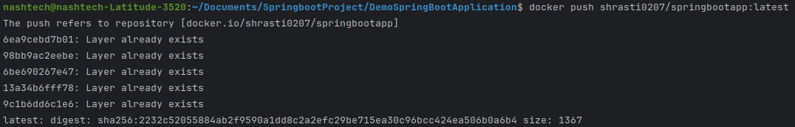

# Spring Boot Docker Example

This is a simple Spring Boot application with two REST endpoints:

- `GET /` — Returns "Hello Spring Boot!"
- `GET /name` — Returns "Hello world"

The application is packaged as a Docker image and can be pushed to Docker Hub.

